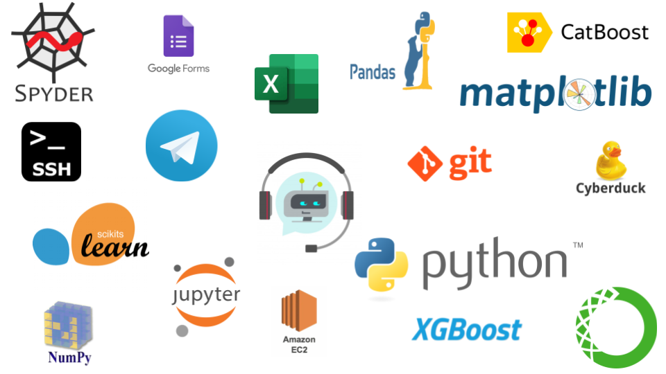

## This chat-bot requires: 
>* catboost==0.24.1 
>* xgboost==1.2.0 
>* scikit-learn==0.23.2 
>* joblib==0.17.0 
>* numpy==1.19.2 
>* PyTelegramBotAPI==3.6.7

## To run the project in terminal run this command: 
>* python Main.py startbot

